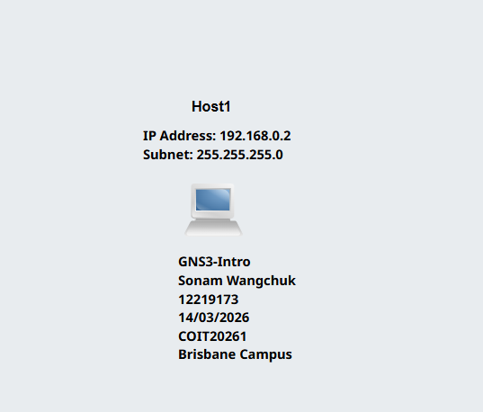
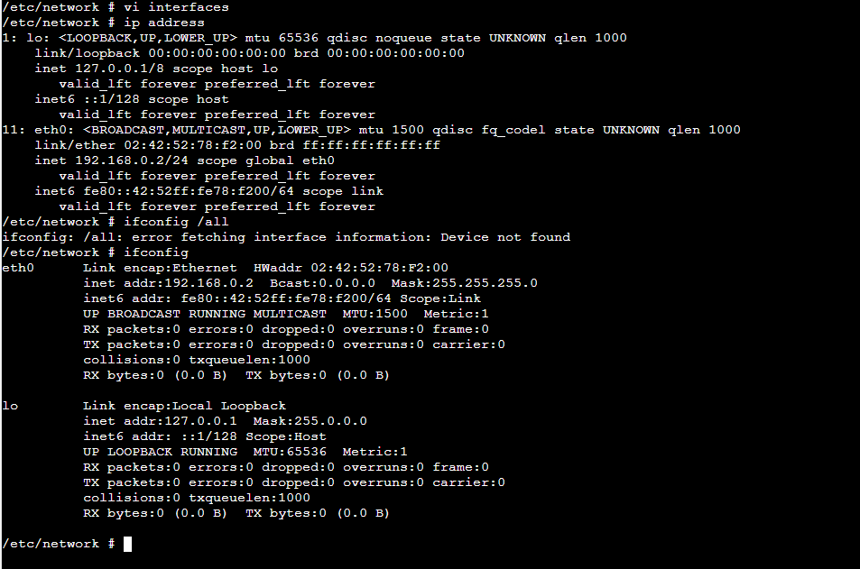

# Task 1: Introduction to GNS3 Basics
## Outputs
1. GNS3 File \
[GNS3-Basics](GNS3-Files/GNS3-Intro-12219173.gns3project) 

3. Screenshot of Network \
 

4. Screenshot of console showing IP Address \
 
