# Week 02: Encapsulation and Decapsulation

## Task 1: Setting Static IP Addresses
## Outputs
1. GNS3 File \
[GNS3-Setting IP](GNS3-Files/Setting-IP-12219173.gns3project)

2. Network Diagram \
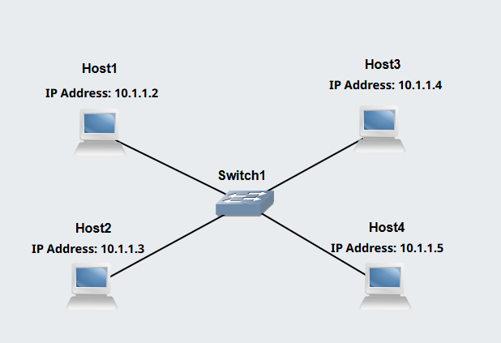

3. IP Address of Hosts \

The IP address for Host1 and Host2 are assigned manually from the configure menu in GNS3 by removing the # from some commands.\
The IP assigned are not interupted by restart of the device.

**Host 1** \
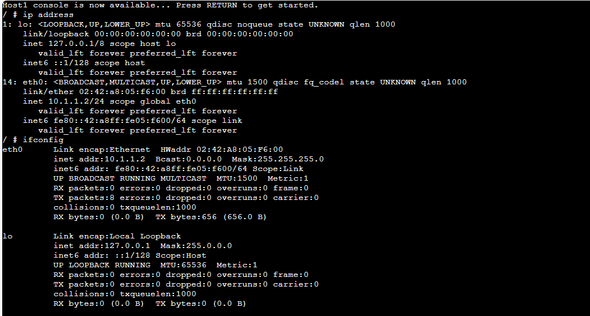 

**Host 2** \
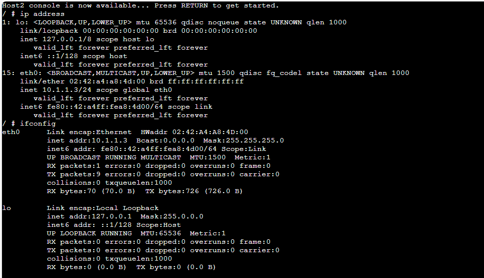 

**Host 3** \

The IP for Host3 is assigned using command from terminal ( *ip address add <ipaddress>/<mask> dev eth0* ) \
*#ip address 10.1.1.4/24 dev eth0* \
The IP Configuration gets erased upon restart of the linux host.

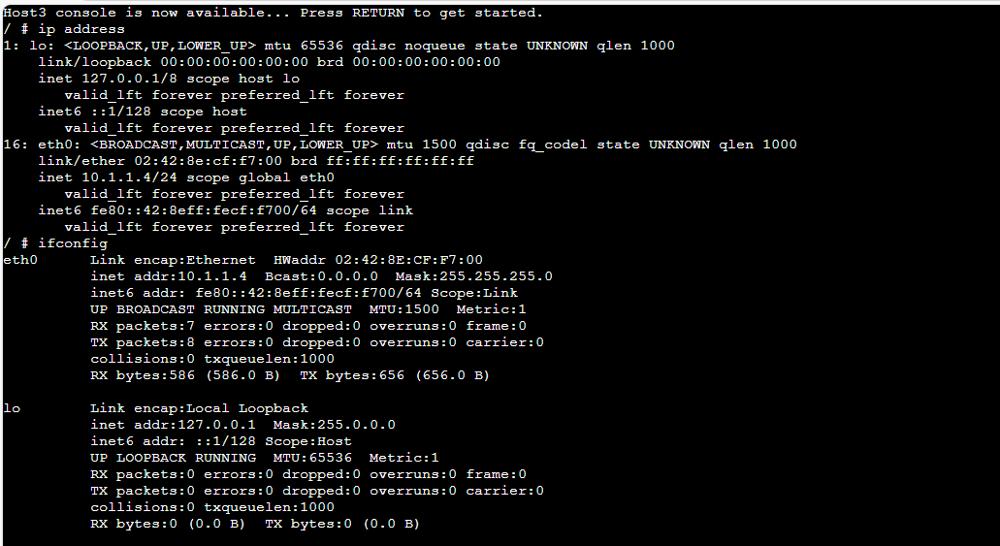 

**Host 4** \

The IP is assigned via terminal. Open host4 terminal and edit the configuration file *interfaces* located in /etc/network directory.
Used text editor nano to edit the configuration file. \
The IP assigned is fixed and the restart doesnt removed the IP. 

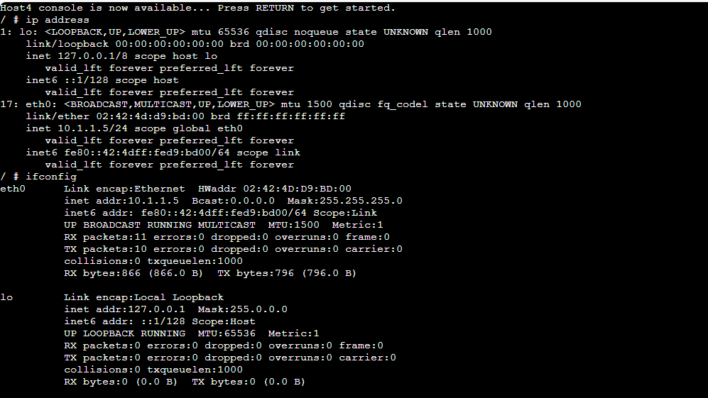 

## Task 2: Testing Network Connectivity and Delay with Ping

## Outputs

1. Ping command output \
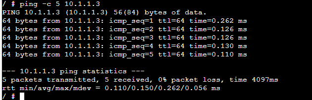

2. Ping command and output to a wrong IP \
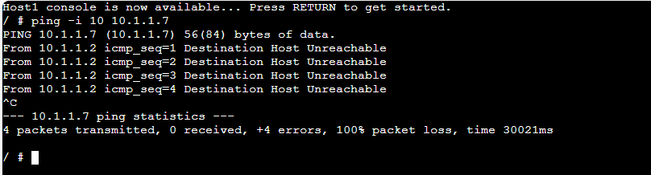

3. Ping command (and output) when limiting the count, setting the data size and interval to non-default values.

With Count Limit \
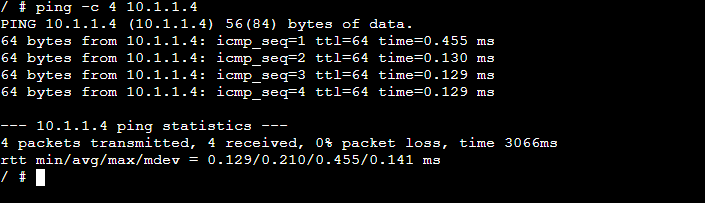

With Custom Data Size \
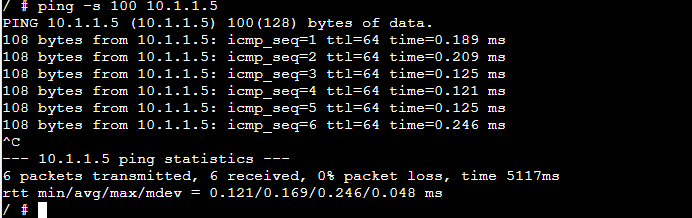

With Custom Interval \
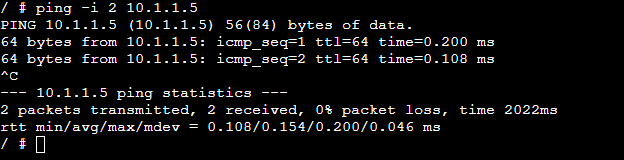

Customized Ping using various custom paramaters \
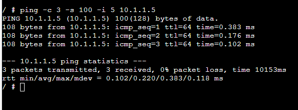
