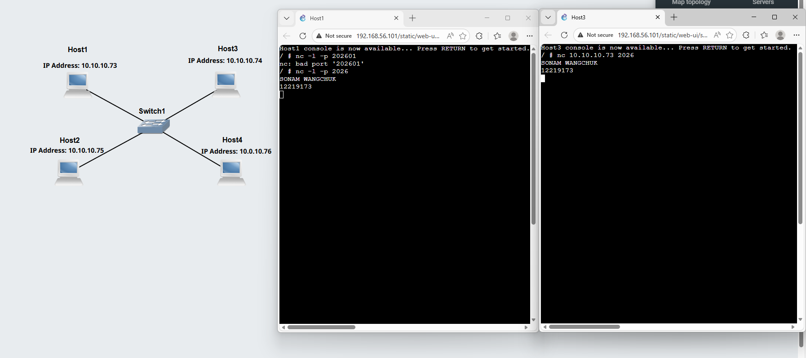

# Week 03: The TCP and IP Protocols

## Task 1: Simple Application Communications with Netcat
## Outputs
Netcat Client and Netcat Server   
   

*is a lightweight, command‑line networking utility used to read and write data across network connections using TCP or UDP.    
Commands used   
$nc -l -p portnumber    
$nc IPAddress portnumber*   

## Task 2: Capturing Packets

## Outputs

PCAP File for Ping and Netcat Capture    
*The following file is the packet capture file of ping with 3 hop count from host A to Host B*    
[Packet-Capture](PCAP-Files/Capture-Basics-12219173-ping-netcat.pcap)

