# Week 04: Routing

## Task 1: View Routing Tables 
## Outputs
1. GNS3 Project file      
[View Route GNS3 File](GNS3-Files/View-Route-12219173.gns3project)

3. Network Diagram   
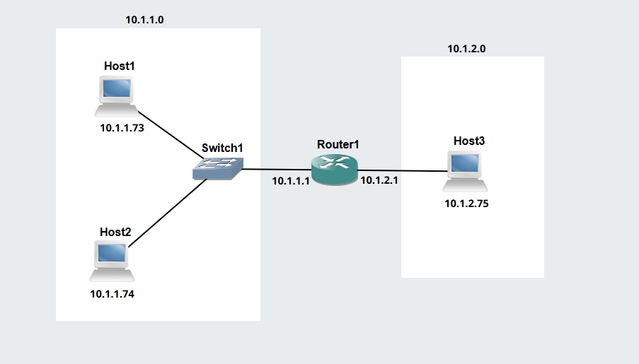

4. Record of IP Routes    
*An IP route is an entry in a routing table that tells a device:   
Destination network -where the packet wants to go   
Next hop -which router to send it to   
Outgoing interface -which port to use*

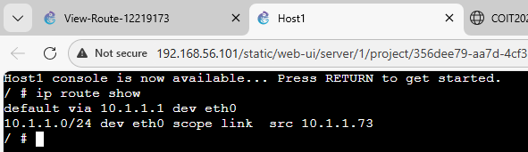   
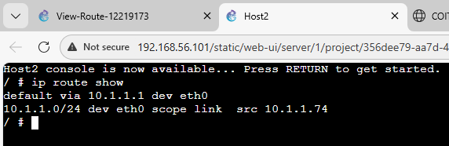   
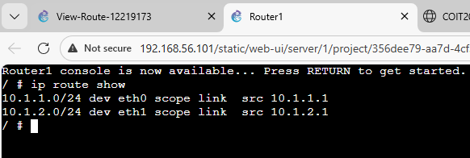   
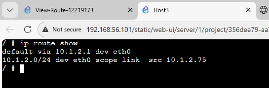   

4. Ping to other network
*To test the route of the network, ping command is used*    
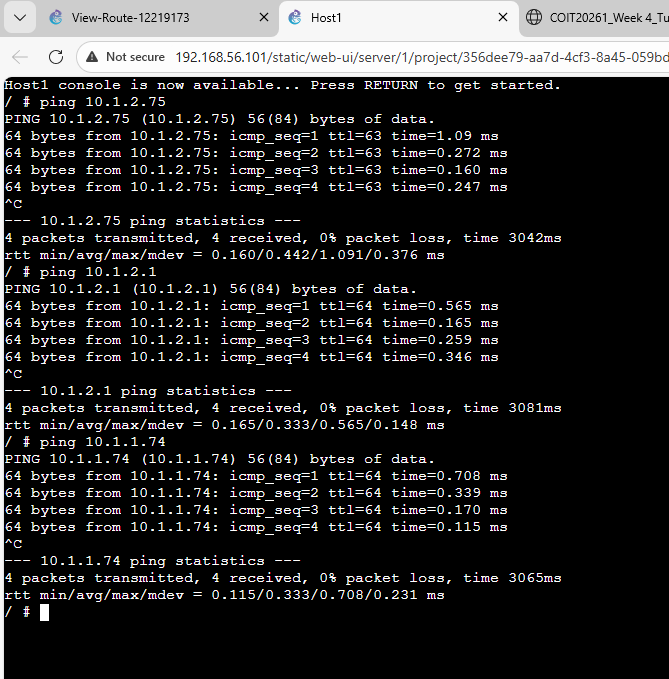   

## Task 2: Dynamic Routing with OSPF

## Outputs

1. GNS3 File demonstrating OSPF     
[GNS3-Routing-OSPF](GNS3-Files/OSPF-Basics-12219173-Template.gns3project)
 
3. Network Diagram demonstrating OSPF     
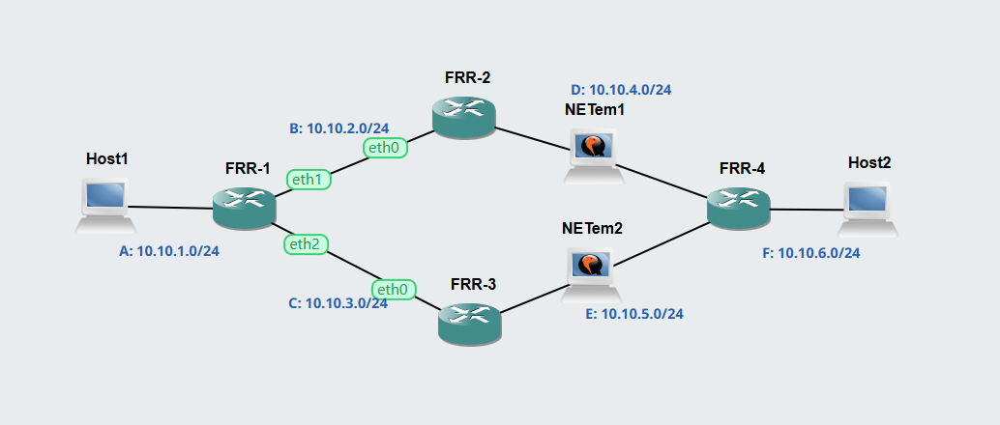

*OSPF (Open Shortest Path First) is a link‑state routing protocol used inside an autonomous system to find the shortest and most efficient path between networks. It uses Dijkstra’s SPF algorithm to compute routes and maintains a full view of the network topology, which gives it fast convergence and high scalability*   

5. Neigbour routers of FRR1     
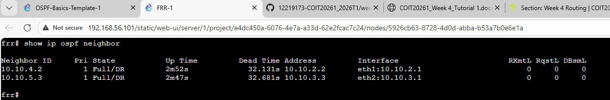   

6. Routing table for two routers       
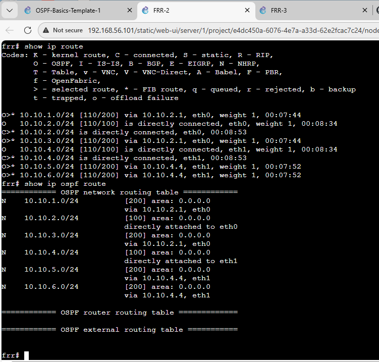     
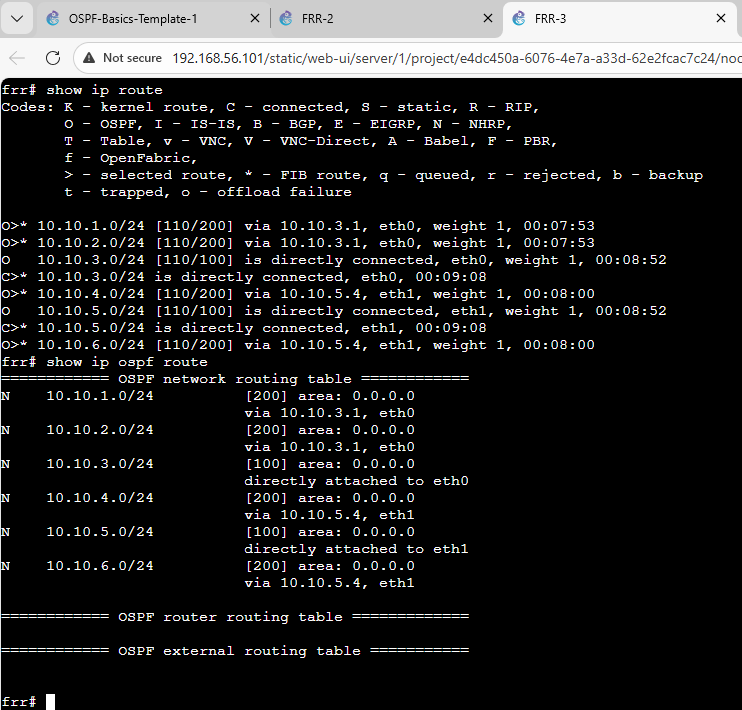    

7. Routing Table Summary    

FRR‑1
| Destination | Next Node |
|------------|-----------|
| 10.10.1.0/24 | Direct |
| 10.10.2.0/24 | FRR‑2 |
| 10.10.3.0/24 | FRR‑3 |
| 10.10.4.0/24 | FRR‑2 |
| 10.10.5.0/24 | FRR‑3 |
| 10.10.6.0/24 | FRR‑2 or FRR‑3 → FRR‑4 |

FRR‑2
| Destination | Next Node |
|------------|-----------|
| 10.10.2.0/24 | Direct |
| 10.10.4.0/24 | Direct |
| 10.10.1.0/24 | FRR‑1 |
| 10.10.3.0/24 | FRR‑1 or FRR‑3 |
| 10.10.5.0/24 | FRR‑1 → FRR‑3 |
| 10.10.6.0/24 | FRR‑1 → FRR‑3 → FRR‑4 |

FRR‑3
| Destination | Next Node |
|------------|-----------|
| 10.10.3.0/24 | Direct |
| 10.10.5.0/24 | Direct |
| 10.10.1.0/24 | FRR‑1 |
| 10.10.2.0/24 | FRR‑1 or FRR‑2 |
| 10.10.4.0/24 | FRR‑1 → FRR‑2 |
| 10.10.6.0/24 | FRR‑4 |

FRR‑4
| Destination | Next Node |
|------------|-----------|
| 10.10.6.0/24 | Direct |
| 10.10.3.0/24 | FRR‑3 |
| 10.10.5.0/24 | FRR‑3 |
| 10.10.1.0/24 | FRR‑3 → FRR‑1 |
| 10.10.2.0/24 | FRR‑3 → FRR‑1 → FRR‑2 |
| 10.10.4.0/24 | FRR‑3 → FRR‑1 → FRR‑2 |

6. Traceroute Command Output    
* Without stopping NETem      
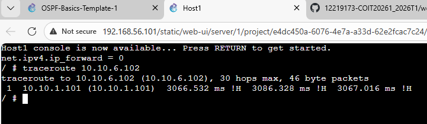   

* Stopping NETem 1     
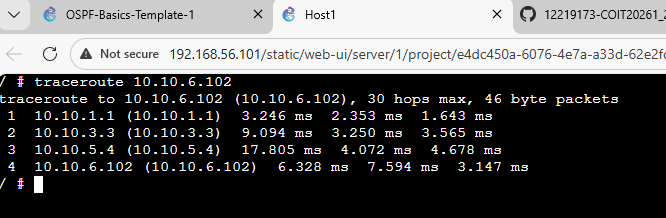

    
*Commands Learned      
$show ip ospf neighbor     
$show ip ospf route     
$show ip route     
$ip route show      
$sysctl net.ipv4.ip_forward=1*

