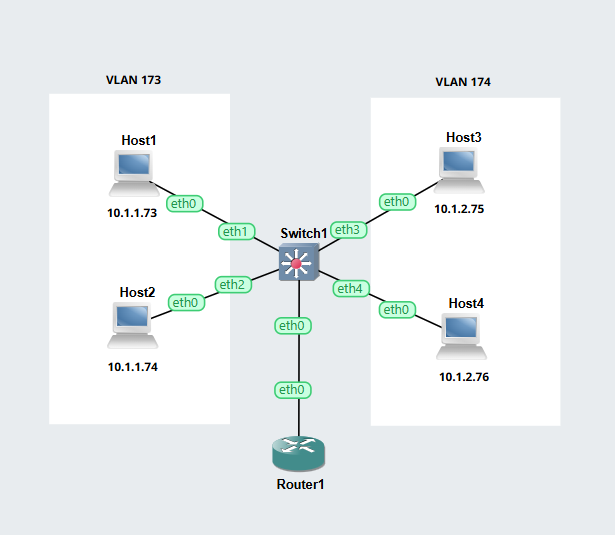
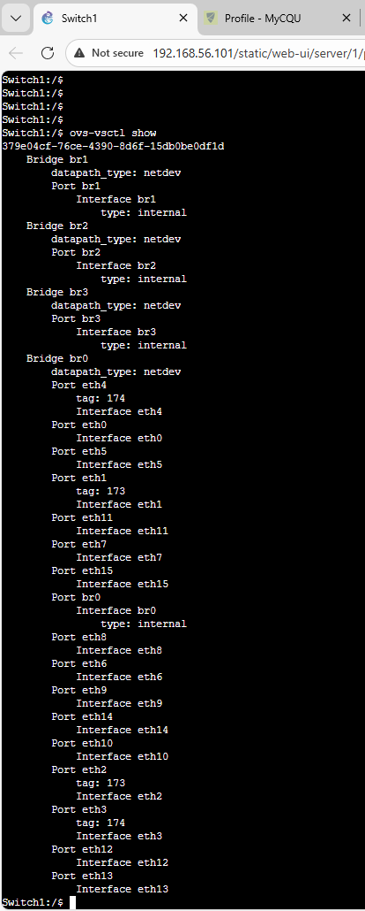

# Week 05: Switching and VLAN

## Task 1: Set Up VLAN Switch    
## Outputs    
1. GNS3 VLAN File       
[VLAN GNS3 File](GNS3-Files/Vlan-Basics-12219173.gns3project)   

2. Network Diagram    

*A VLAN is a logical grouping of devices that communicate as if they are on the same LAN, even when connected to different switches. VLANs reduce broadcast traffic, improve security, and allow flexible network design.*    

4. Ports and Tags    
   

## Task 2: Setup VLANs on a Router
## Outputs  
1. GNS3 VLAN File       
[VLAN GNS3 File](GNS3-Files/Vlan-Router-12219173.gns3project)   

2. Network Diagram    
     

4. Ports and Tags    
   
