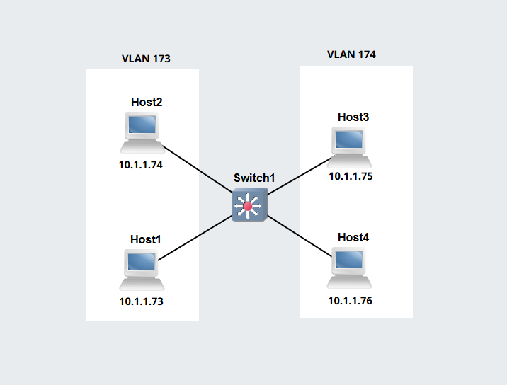
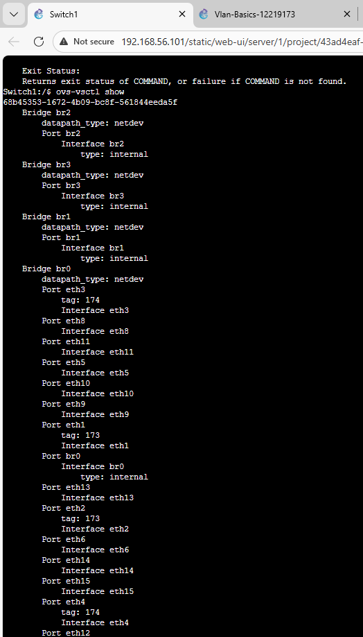

# Week 05: Switching and VLAN

## Task 1: Set Up VLAN Switch    
## Outputs    
1. GNS3 VLAN File   
[VLAN GNS3 File](GNS3-Files/Vlan-Basics-12219173.gns3project)   

2. Network Diagram
   

3. Ports and Tags
   
