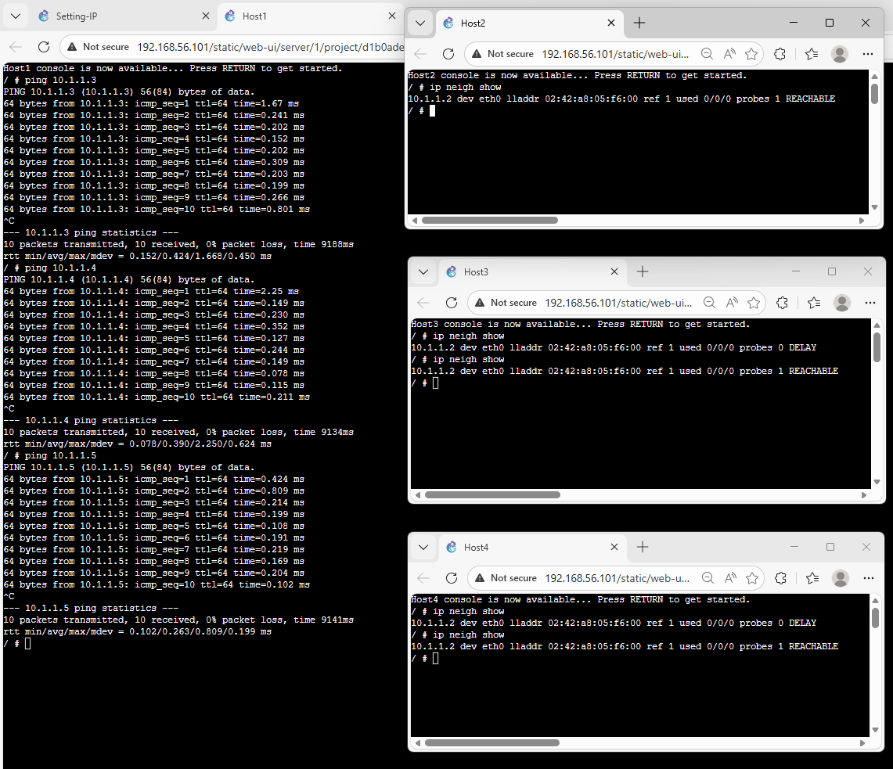
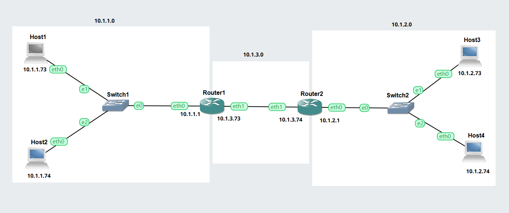
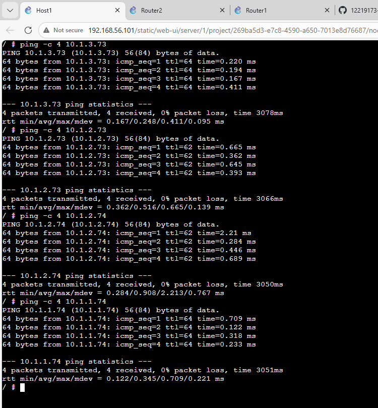

# Week 06: Address Resolution and Management

## Task 1: Resolving IP Addresses to Hardware Addresses
## Outputs    

1. Host1 ARP    
    
*ARP (Address Resolution Protocol) is the protocol a device uses to map an IPv4 address to a MAC address on a local network. It operates at the boundary of Layer 2 (MAC) and Layer 3 (IP) and is essential for delivering packets on Ethernet networks.    
When a device wants to send an IP packet to another device on the same LAN, it must know the destination MAC address.    
ARP solves this by:    
- Asking: “Who has this IP?” (broadcast)     
- The owner of that IP replies with: “I have it — here is my MAC.” (unicast)     
- The sender stores the mapping in its ARP cache for future use*      

## Task 2: Default Gateways
## Outputs  
1. GNS3 VLAN File       
[VLAN GNS3 File](GNS3-Files/Default-Gateway-12219173.gns3project)   

2. Network Diagram    
   

3. Ports and Tags    
Interface Details

| Device   | Interface | IP Address     | Subnet Mask     | Network     |
|----------|-----------|----------------|------------------|-------------|
| Host1    | eth0      | 10.1.1.73      | 255.255.255.0    | 10.1.1.0/24 |
| Host2    | eth0      | 10.1.1.74      | 255.255.255.0    | 10.1.1.0/24 |
| Router1  | eth0      | 10.1.1.1       | 255.255.255.0    | 10.1.1.0/24 |
| Router1  | eth1      | 10.1.3.73      | 255.255.255.0    | 10.1.3.0/24 |
| Router2  | eth0      | 10.1.2.1       | 255.255.255.0    | 10.1.2.0/24 |
| Router2  | eth1      | 10.1.3.74      | 255.255.255.0    | 10.1.3.0/24 |
| Host3    | eth0      | 10.1.2.73      | 255.255.255.0    | 10.1.2.0/24 |
| Host4    | eth0      | 10.1.2.74      | 255.255.255.0    | 10.1.2.0/24 |    

Route Details     
| Device   | Destination     | Next Hop         | Interface |
|----------|------------------|------------------|-----------|
| Router1  | 10.1.1.0/24      | directly connected | eth0 |
| Router1  | 10.1.3.0/24      | directly connected | eth1 |
| Router1  | 10.1.2.0/24      | 10.1.3.74          | eth1 |
| Router2  | 10.1.2.0/24      | directly connected | eth0 |
| Router2  | 10.1.3.0/24      | directly connected | eth1 |
| Router2  | 10.1.1.0/24      | 10.1.3.73          | eth1 |    

4. Ping to Other Network

   

*Commands Used    
$ip neigh show   
$ip route add default via IPAddress dev eth0   
$ip route add 3.3.3.0/24 via 1.1.1.1 dev eth0*
